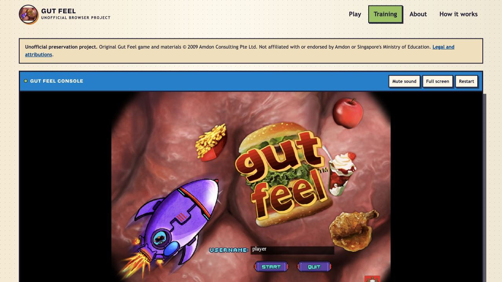
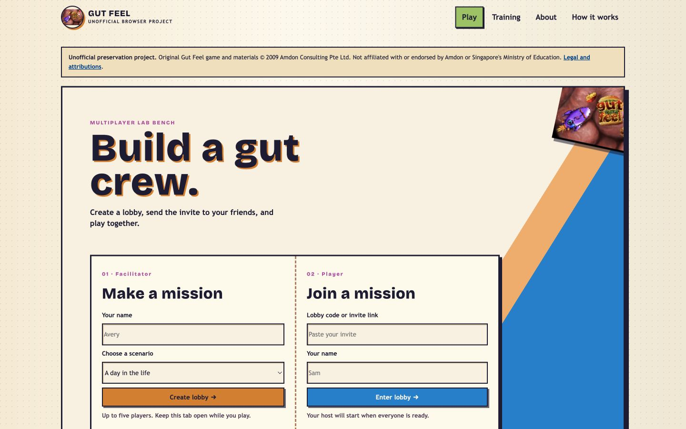
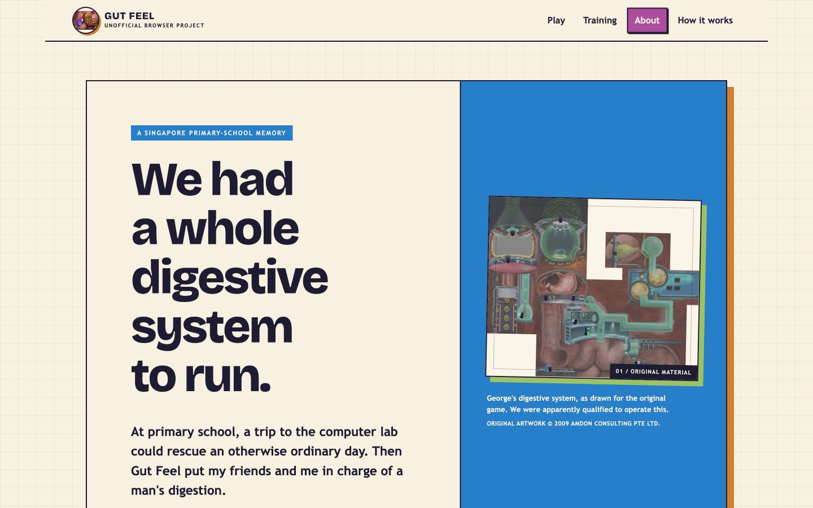

# Gut Feel, in the browser

An unofficial preservation port of Amdon's 2009 multiplayer educational game
for Singapore's Ministry of Education. It runs the original Adobe Director
movies in a browser and replaces the retired multiplayer service with a small
Node.js and WebSocket server.

**[Play Gut Feel in your browser →](https://gutfeel.atzy.dev/)**

The browser-ready movies, manuals, artwork, audio, and report assets are
included so a checkout can run the complete game. They retain their original
copyright and are not covered by the browser project's GPL licence.

## Screenshots

[](https://gutfeel.atzy.dev/?mode=tutorial)

<p align="center">
  
  
</p>

## Requirements

- Node.js 22 or newer

## Test the public source

```sh
npm ci
npm test
```

## Run locally

Install dependencies and start the server:

```sh
npm ci
npm start
```

Open <http://localhost:4173>.

## Deploy

The production deployment runs one Docker container on `tinymart`, bound only
to loopback and published through the host's existing Cloudflare Tunnel:

```sh
git pull --ff-only
docker compose -f compose.home.yml up -d --build
curl -fsS http://127.0.0.1:4173/health
```

The `atzy-dev` tunnel routes `gutfeel.atzy.dev` to the loopback listener. See
[docs/SELF_HOSTING.md](docs/SELF_HOSTING.md) for setup, security, verification,
and operational details.

The Docker image can also run on any single-instance container host. A public
deployment requires the exact browser origin and a link to the Corresponding
Source for that build:

```sh
docker build -t gutfeel .
docker run --rm \
  -e PUBLIC_ORIGIN=https://gutfeel.example.org \
  -e SOURCE_CODE_URL=https://code.example.org/gutfeel \
  -p 4173:4173 \
  gutfeel
```

Run one always-on replica and keep HTTP and WebSockets on the same origin.

## Source layout

- `web/public/` — complete browser application, game assets, and built runtime
- `server/` and `server.mjs` — lobby and WebSocket services
- `recovered/runtime.patch` — changes to the pinned GPL-3.0 DirPlayer source
- `tools/` — recovery, build, and verification scripts
- `tests/` — automated protocol, server, and browser-behaviour tests
- `docs/ORIGINAL_RULES.md` — original game behavior and scoring reference
- `docs/SELF_HOSTING.md` — production deployment and security notes

## Licences

Project-owned code and documentation are GPL-3.0-only. Original Gut Feel
materials are excluded from that grant. DirPlayer is GPL-3.0-only; Ruffle is
MIT OR Apache-2.0; `ws` is MIT; Bricolage Grotesque uses the SIL Open Font
License 1.1.

See [LICENSE](LICENSE), [THIRD_PARTY_NOTICES.md](THIRD_PARTY_NOTICES.md), and
the site's [legal and attribution page](web/public/legal.html).
